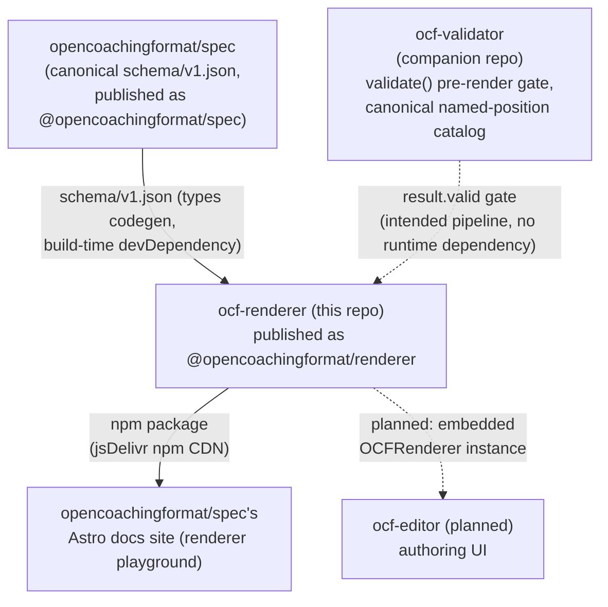

# 3. System Scope and Context

## 3.1 Business Context

`Validator -.-> Renderer` and `Renderer -.-> Editor` are dashed because
neither is an actual runtime/build dependency today: the validate-then-render
pipeline is a documented usage convention, not code that imports
`ocf-validator`, and `ocf-editor` is planned, not yet built against this
renderer.

## 3.2 Technical Context

| Interface | Direction | Description |
|---|---|---|
| `new OCFRenderer(doc, options)` / `renderer.renderToCanvas(frameIndex, canvas)` | Inbound | Primary integration point: construct once per document, render to a `<canvas>` synchronously. See [Building Block View §5.2](05-building-block-view.md). |
| `@opencoachingformat/spec` (npm devDependency) | Outbound, build-time only | Provides `schema/v1.json`, consumed by `scripts/generate-ocf-types.mjs` to produce `src/types/ocf.generated.ts`. Not a runtime dependency — the generated types are compiled into the published package; consumers never install `@opencoachingformat/spec` themselves. |
| npm registry (`registry.npmjs.org`) | Outbound, publish-time only | `release.yml` publishes `@opencoachingformat/renderer` on every `v*` tag via OIDC trusted publishing. |
| jsDelivr npm CDN | Outbound, consumer-side | The `opencoachingformat/spec` docs site's renderer playground fetches the pre-built `dist/browser/index.js` bundle directly from jsDelivr's npm mirror, pinned to a specific published version — not a git-commit pin (see that repo's `site/src/lib/renderer-version.mjs`). |
| Three.js (npm dependency) | Inbound | The only runtime dependency. Bundled into the browser build (`dist/browser/index.js` has no bare `from 'three'` import — enforced by `scripts/verify-browser-bundle.mjs`); a peer/regular dependency for the standard ESM/CJS build. |
