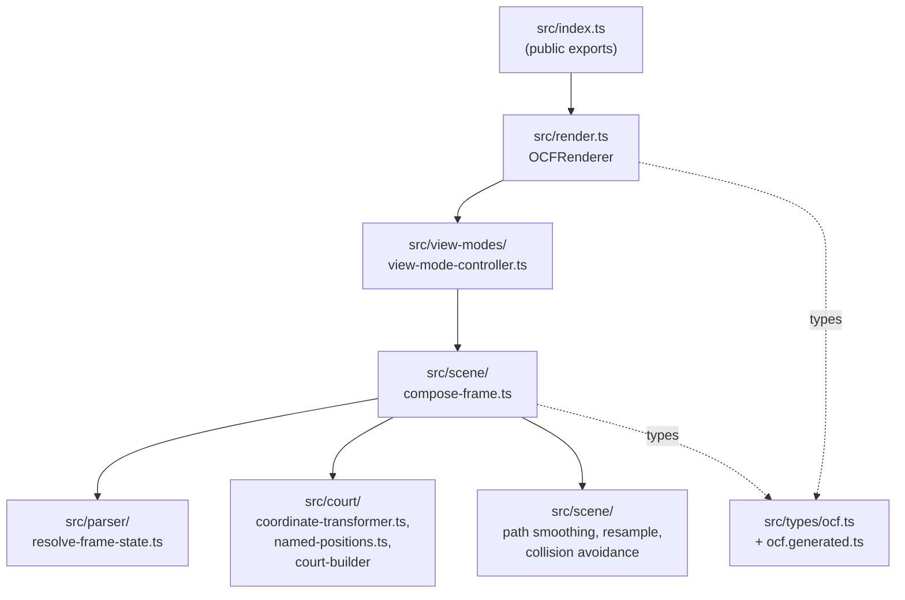
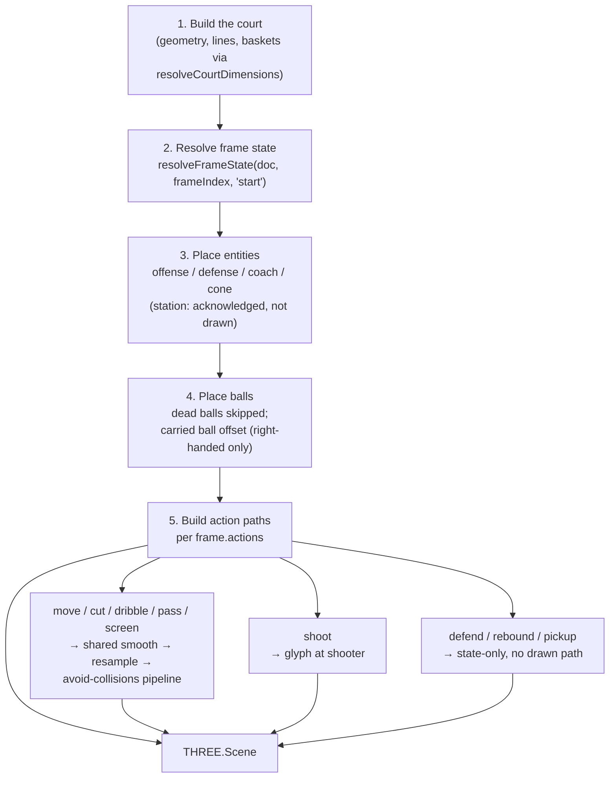

# 5. Building Block View

## 5.1 Whitebox Overall System

| Building Block | Responsibility |
|---|---|
| `src/index.ts` | Public API surface — the only module external consumers import from. |
| `src/render.ts` (`OCFRenderer`) | Top-level class: owns a `ViewModeController`, exposes `setMode`, `renderFrame`, `renderToCanvas`, `dispose`. Bridges the pure scene-graph pipeline to an actual `THREE.WebGLRenderer` + `<canvas>`. |
| `src/view-modes/view-mode-controller.ts` (`ViewModeController`) | Single dispatch point between a `ViewMode` and its scene builder. Returns `{status:"ok", scene}` for `tactical_print`; `{status:"not_implemented", mode}` for any other mode — the seam `coaching_animation` will plug into later. |
| `src/scene/compose-frame.ts` (`composeFrame`) | Pure function, the heart of `tactical_print`: given a document + frame index, resolves frame state, places entities, places balls, builds action paths, and returns a populated `THREE.Scene`. No I/O, no mutable state across calls. |
| `src/parser/resolve-frame-state.ts` (`resolveFrameState`) | Walks `doc.frames[0..frameIndex]`, applying each frame's `start_state`/`end_state` deltas to accumulate the actual entity/ball positions and possession state at a given frame — since OCF frames are deltas, not full snapshots. |
| `src/court/coordinate-transformer.ts` (`CoordinateTransformer`, `resolveCourtDimensions`) | Resolves the three OCF coordinate variants (`{x,y}`, `{named}`, `{relative_to,dx,dy}`) into world-space `THREE.Vector3`; merges FIBA default dimensions with `custom_dimensions` and converts feet to meters. |
| `src/court/named-positions.ts` | The renderer's local catalog mapping named court positions (e.g. `top_of_the_key`, `paint_center`) to court-relative coordinates. Must track `ocf-validator`'s canonical catalog — see [Risks §11](11-risks-technical-debt.md). |
| Path pipeline (within `src/scene/`) | Smooths action `moves` anchors into a curve (`CatmullRomCurve3`), resamples it at constant arc length, trims for arrowheads, and steers it around entity symbols (collision avoidance) — shared by `move`/`cut`/`dribble`/`pass`/`screen`. |
| `src/types/ocf.generated.ts` / `src/types/ocf.ts` | Generated OCF types plus the thin, rename-only compat layer described in [Constraints §2](02-architecture-constraints.md). |

## 5.2 Level 2: Inside `compose-frame.ts`

For a single frame, `composeFrame` runs, in order:

1. **Build the court** — geometry, lines, and (if applicable) both baskets, sized via `resolveCourtDimensions`.
2. **Resolve frame state** — via `resolveFrameState(doc, frameIndex, "start")`, giving the accumulated entity/ball positions entering this frame.
3. **Place entities** — offense, defense, coach, cone symbols at their resolved coordinates; `station` entities are acknowledged in the type system but not currently drawn.
4. **Place balls** — dead balls are skipped; a carried ball is drawn with a fixed forward/right-handed offset from its holder (see [Risks §11](11-risks-technical-debt.md) — no handedness data exists in the schema yet).
5. **Build action paths** — for each of `frame.actions`, dispatch by action type: `move`/`cut`/`dribble`/`pass`/`screen` go through the shared smooth → resample → avoid-collisions pipeline (with per-type styling — dashed for `pass`, wave for `dribble`, end-bar for `screen`); `shoot` places a glyph at the shooter; `defend`/`rebound`/`pickup` are handled as state-only (no drawn path).
