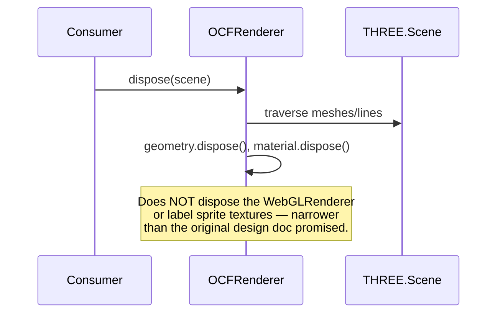

# 6. Runtime View

## 6.1 Scenario: Rendering a single frame to a canvas (`tactical_print`)

The primary, and currently only fully implemented, runtime scenario.

```mermaid
sequenceDiagram
    participant Consumer
    participant OCFRenderer
    participant ViewModeController
    participant composeFrame
    participant resolveFrameState
    participant CoordinateTransformer
    participant WebGLRenderer as THREE.WebGLRenderer

    Consumer->>OCFRenderer: new OCFRenderer(doc, {mode: "tactical_print"})
    Consumer->>OCFRenderer: renderToCanvas(frameIndex, canvas)
    OCFRenderer->>ViewModeController: renderFrame(doc, frameIndex)
    ViewModeController->>composeFrame: composeFrame(doc, frameIndex)
    composeFrame->>resolveFrameState: resolveFrameState(doc, frameIndex, "start")
    resolveFrameState-->>composeFrame: accumulated entity/ball state
    composeFrame->>CoordinateTransformer: resolve(coord) [per entity/ball/path point]
    CoordinateTransformer-->>composeFrame: THREE.Vector3
    composeFrame-->>ViewModeController: THREE.Scene
    ViewModeController-->>OCFRenderer: {status: "ok", scene}
    OCFRenderer->>OCFRenderer: build THREE.OrthographicCamera (fit to court + aspect)
    OCFRenderer->>WebGLRenderer: new WebGLRenderer({canvas}); setSize(...)
    OCFRenderer->>WebGLRenderer: render(scene, camera)
    WebGLRenderer-->>Consumer: pixels drawn to canvas
```

Notes on the real (not idealized) behavior:

- **Synchronous, not async.** `renderToCanvas` returns once `renderer.render()` has been called — there is no `Promise`, despite an earlier design doc describing one (see [ADR §9](09-architecture-decisions.md)).
- **A new `WebGLRenderer` is created on every call.** `renderToCanvas` does not cache or reuse a renderer instance across calls — a documented `TODO(post-v1)` and a known resource-leak risk under repeated calls; see [Risks §11](11-risks-technical-debt.md).
- **`renderFrame` (without `ToCanvas`)** is the lower-level entry point: it returns `RenderFrameResult & {camera?}` without touching a canvas, letting a consumer build/manage their own `WebGLRenderer` (e.g. to reuse one across frames) — the escape hatch for the leak above.
- **A `not_implemented` mode short-circuits before any scene work.** Calling `renderToCanvas` with a mode other than `tactical_print` throws, because `ViewModeController.renderFrame` returns `{status: "not_implemented", mode}` instead of a scene, and `OCFRenderer` throws on that status rather than silently rendering nothing.

## 6.2 Scenario: Disposing scene resources



A consumer calling `renderToCanvas` repeatedly (e.g. a UI that re-renders on
every frame-index change) must not rely on `dispose()` alone to prevent GPU
resource growth — see [Risks and Technical Debt](11-risks-technical-debt.md).
