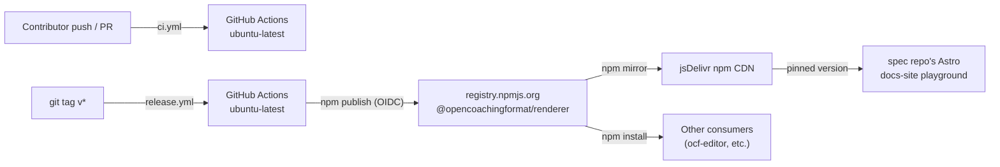

# 7. Deployment View

The renderer has no server component — "deployment" here means **npm
publishing** and **consumer-side loading**, not hosting a service.

## 7.1 Infrastructure

## 7.2 CI pipeline (`ci.yml`)

Runs on every push and pull request, on `ubuntu-latest` with Node 22:

1. `npm ci`
2. `npm run generate:types` — regenerates `src/types/ocf.generated.ts` from `@opencoachingformat/spec`'s schema *before* type-checking (this ordering was itself a bug fixed during development — see [ADR §9](09-architecture-decisions.md)).
3. `npx tsc --noEmit`
4. `npm test` (vitest)
5. `npm run build` (standard ESM/CJS + `.d.ts`)
6. `npm run build:browser` (browser IIFE bundle)

Note: `ci.yml` does not currently run `npm run test:visual` (Playwright) or
`npm run test:browser` (bundle-shape verification) — see
[Risks §11](11-risks-technical-debt.md).

## 7.3 Release pipeline (`release.yml`)

Triggered by pushing a `v*` tag. Publishes to npm via **OIDC trusted
publishing** — no `NPM_TOKEN` secret, `id-token: write` permission instead:

1. Checkout, `actions/setup-node@v6` (Node 22).
2. **`npm install -g npm@latest`** — required because trusted publishing
   needs npm CLI ≥ 11.5.1, and Node 22's bundled npm is only 10.9.8
   (`actions/setup-node` does not upgrade npm itself). Verified against a
   real failing run's logs before this step was added.
3. Guard: the pushed tag (`vX.Y.Z`) must match `package.json`'s `version`
   field exactly, or the workflow fails fast with a clear error instead of
   publishing a mismatched version.
4. `npm ci`, `npm run generate:types`, `npx tsc --noEmit`, `npm test`.
5. `npm publish` — `prepublishOnly` runs `build` + `build:browser` first;
   OIDC trusted publishing supplies provenance automatically (no
   `--provenance` flag needed).

Trusted publishing requires the npm package to already exist and have a
trusted publisher configured on npmjs.com pointing at this repository and
this exact workflow file — bootstrapped once via a manual `npm publish`
before any tag-triggered release could work.

## 7.4 Consumer-side loading

- **npm**: `npm install @opencoachingformat/renderer`, then either the
  standard import (`./dist/index.js`/`.cjs`) or the explicit browser export
  (`./browser` → `./dist/browser/index.js`, Three.js inlined, no bundler
  resolution of a bare `three` import required).
- **CDN (docs-site playground)**: loads `dist/browser/index.js` directly
  from jsDelivr's **npm** mirror, pinned to a specific published version
  number — deliberately not a `cdn.jsdelivr.net/gh/...` git-commit pin,
  which is what caused the original "Unknown named position" bug (a stale
  build being served indefinitely from an unmoving commit ref).
