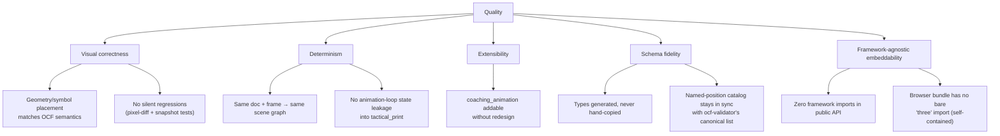

# 10. Quality Requirements

## 10.1 Quality Tree

See [Introduction and Goals §1.2](01-introduction-goals.md) for the
motivation behind each top-level branch.

## 10.2 Quality Scenarios

| # | Scenario | Quality Goal | Verification |
|---|---|---|---|
| 1 | A contributor changes path-smoothing math for `dribble` actions. | Correctness, Determinism | `npm test` (vitest scene-graph snapshots) fails if the produced geometry changes unexpectedly; `npm run test:visual` (Playwright) fails if the rendered pixels drift from the reference PNGs. |
| 2 | `@opencoachingformat/spec` publishes a schema change (new field, changed enum). | Schema fidelity | `npm run generate:types` (run automatically via `pretest`/`prebuild`) regenerates `ocf.generated.ts`; `npx tsc --noEmit` fails immediately if `src/` code no longer matches the new shape — a compile error, not a silent mismatch. |
| 3 | A consumer calls `renderer.renderToCanvas(0, canvas)` twice for two different frame indices on the same `OCFRenderer` instance. | Determinism | Each call produces its own fresh `THREE.Scene` via the pure `composeFrame`; no state from the first call leaks into the second's scene graph (though the `WebGLRenderer` itself is *not* reused — see [Risks §11](11-risks-technical-debt.md), a resource-lifecycle gap, not a correctness one). |
| 4 | A future PR adds `coaching_animation` support. | Extensibility | `ViewModeController` already has a tested `not_implemented` branch for every non-`tactical_print` mode; adding the mode means adding a new scene-builder branch there, not restructuring `OCFRenderer` or the public API. |
| 5 | `ocf-editor` imports `@opencoachingformat/renderer` into a plain esbuild/IIFE app with no framework. | Framework-agnostic embeddability | `src/index.ts`'s exports have zero React/Vue/framework imports; `scripts/verify-browser-bundle.mjs` (run via `npm run test:browser`) asserts the built `dist/browser/index.js` has no bare `from 'three'` import and does export `OCFRenderer`. |
| 6 | A malformed (schema-invalid) OCF document is passed to `OCFRenderer` without first running it through `ocf-validator`. | (Explicitly out of scope — documents the boundary) | No test guarantees graceful behavior here; this is the accepted trade-off in [ADR-05](09-architecture-decisions.md). |
